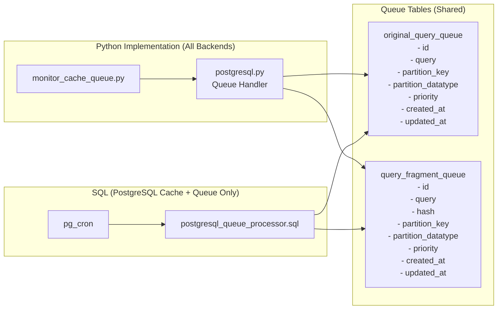

# PartitionCache

[](LICENSE)
[](https://www.python.org/downloads/)
[](https://doi.org/10.18420/BTW2025-23)

Partition-based query optimization middleware for heavily partitioned datasets. PartitionCache automatically decomposes complex queries into variants, caches which partitions contain results for each variant, and uses this knowledge to dramatically reduce search space for future queries by skipping partitions that won't contain results.

## How It Works

1. **Query Decomposition**: Complex queries with multiple conditions are automatically broken down into simpler variants
2. **Partition Discovery**: Each variant is executed to find which partitions contain matching data
3. **Cache Storage**: Results are cached as sets of partition IDs for each query variant
4. **Search Space Reduction**: Future queries use cached results to skip partitions without matches
5. **Intersection Optimization**: Queries with AND conditions benefit from set intersections of cached results

## Key Features

- **Multi-Partition Support**: Manage multiple partition keys with different datatypes
- **Multiple cache backends**: PostgreSQL arrays/bits/roaringbitmap, Redis sets/bits, DuckDB BITSTRING, RocksDB variants
- **Intelligent Queue System**: Two-tier queue architecture with priority support and blocking operations
- **Database-native processing** with pg_cron integration
- **Cache Eviction Management**: Automatic cleanup with pg_cron integration
- **Comprehensive CLI tools** for management and monitoring
- **Query rewriting** with conjunctive (AND) condition optimization

## When to Use

- Complex analytical queries (> few ms execution time)
- Read-only or append-only datasets  
- Searches across logical partitions (cities, regions, time periods, network segments)
- Results of queries who match usually only on a subset of the partitions (sparse results, no aggregations across all partitions)
- Queries with multiple conjuncts (AND conditions)

## Installation

```bash
pip install git+https://github.com/MPoppinga/PartitionCache@main
```

## Quick Start

### Environment Setup

Create `.env` file (or use the `.env.example` file as a template):
```env
# Database
DB_HOST=localhost
DB_PORT=5432
DB_USER=app_user
DB_PASSWORD=secure_password
DB_NAME=application_db

# Cache Backend
CACHE_BACKEND=postgresql_array

# Queue System
QUERY_QUEUE_PROVIDER=postgresql
PG_QUEUE_HOST=localhost
PG_QUEUE_PORT=5432
PG_QUEUE_USER=app_user
PG_QUEUE_PASSWORD=secure_password
PG_QUEUE_DB=application_db
```

### Basic Usage

```python
import partitioncache

# Create cache handler
cache = partitioncache.create_cache_helper("postgresql_array", "user_id", "integer")

# Store partition keys
cache.set_set("query_hash", {1, 2, 3, 4, 5})

# Retrieve partition keys
partition_keys = cache.get("query_hash")

# Apply cache to optimize query (recommended approach)
# This automatically:
# 1. Decomposes query into variants (e.g., "WHERE age > 25")
# 2. Checks cache for which user_id partitions have matches
# 3. Rewrites query to only search those partitions
enhanced_query, stats = partitioncache.apply_cache_lazy(
    query="SELECT * FROM users WHERE age > 25",
    cache_handler=cache.underlying_handler,
    partition_key="user_id",
    method="TMP_TABLE_IN"  # Options: "IN_SUBQUERY", "TMP_TABLE_IN", "TMP_TABLE_JOIN"
)
print(f"Cache hits: {stats['cache_hits']}/{stats['generated_variants']}")
# If cached: query now includes "AND user_id IN (1,2,3,4,5)" to skip other partitions

```

## Cache Backend Selection

| Backend | Datatypes | Use Case |
|---------|-----------|----------|
| **postgresql_array** | Various types | Production, full features |
| **postgresql_bit** | Integer only | efficient integers |
| **postgresql_roaringbitmap** | Integer only | Memory-efficient integers |
| **redis_set** | Int, Text | High-throughput, distributed |
| **redis_bit** | Integer only | Memory-efficient Redis |
| **rocksdb_set** | Int, Text | File-based storage |
| **rocksdb_bit** | Integer only | Memory-efficient integers |
| **rocksdict** | Various types | Local storage |

## Processing Models

### 1. Direct Cache Access (Synchronous)
```python
cache = partitioncache.create_cache_helper("postgresql_array", "city_id", "integer")
# Store query results directly in cache for single query
cache.set_set("query_hash", {1, 5, 10, 15})
if cache.exists("query_hash"):
    cached_cities = cache.get("query_hash")
```

### 2. Queue-Based Processing (Asynchronous)
```python
# Add query to queue for decomposition and caching
partitioncache.push_to_original_query_queue(
    "SELECT DISTINCT city_id FROM restaurants WHERE rating > 4.0 AND type = 'italian'",
    partition_key="city_id",
    partition_datatype="integer"
)
# This query will be decomposed into:
# - "WHERE rating > 4.0"
# - "WHERE type = 'italian'"
# Each variant executes and caches its city_id results

# Monitor queue
lengths = partitioncache.get_queue_lengths()
print(f"Original queries: {lengths['original_query_queue']}")
print(f"Decomposed fragments: {lengths['query_fragment_queue']}")
```

### 3. PostgreSQL Queue Processor (Recommended)



```bash
# One-time setup
pcache-postgresql-queue-processor setup


# Configure queue processor (optional)
pcache-postgresql-queue-processor config --max-jobs 10 --frequency 2

# Enable queue processor
pcache-postgresql-queue-processor enable

# Monitor processing
pcache-postgresql-queue-processor status
```

## CLI Tools

| Command | Purpose |
|---------|---------|
| `pcache-manage` | Setup, status, cache operations, maintenance, (backup, restore) |
| `pcache-add` | Add queries to cache |
| `pcache-read` | Read cached partition keys for queries and query variants |
| `pcache-monitor` | Monitor queue, processing queries, populate cache |
| `pcache-postgresql-queue-processor` | PostgreSQL-native processing |
| `pcache-postgresql-eviction-manager` | PostgreSQL-native cache eviction |

```bash
# Setup infrastructure
pcache-manage setup all

# Add queries
pcache-add --direct --query "SELECT ..." --partition-key "user_id"

# Check status
pcache-manage cache overview
```

**📚 Complete CLI Reference**: See [CLI Reference Guide](docs/cli_reference.md)

## Real-World Example

Find cities with parks near Main Street:

```python
# Using apply_cache_lazy (recommended)
cache = partitioncache.create_cache_helper("postgresql_array", "city_id", "integer")

# Send query to queue for decomposition and caching
partitioncache.push_to_original_query_queue(
    "SELECT DISTINCT city_id FROM pois p, streets s WHERE ST_DWithin(p.geom, s.geom, 50) AND p.type = 'park' AND p.area > 900 AND s.name ILIKE '%main street%'",
    partition_key="city_id",
    partition_datatype="integer"
)

# Single function handles cache lookup and query optimization for subsequent queries
enhanced_query, stats = partitioncache.apply_cache_lazy(
    query="""
    SELECT DISTINCT city_id 
    FROM pois p, streets s 
    WHERE ST_DWithin(p.geom, s.geom, 50)
      AND p.type = 'park' 
      AND p.area > 900 
      AND s.name ILIKE '%main street%'
    """,
    cache_handler=cache.underlying_handler,
    partition_key="city_id",
    method="TMP_TABLE_IN"
)

print(f"Query optimized: {stats['enhanced']}")
print(f"Cache performance: {stats['cache_hits']} hits")
```

## Common Workflows

### Multi-Partition Strategy
Handle different partition types simultaneously:
```python
# Create handlers for different partition strategies
city_cache = partitioncache.create_cache_helper("postgresql_array", "city_id", "integer")
region_cache = partitioncache.create_cache_helper("postgresql_array", "region", "text")

# Cache data for both partitions
city_cache.set_set("restaurants_query", {1, 5, 10, 15})
region_cache.set_set("restaurants_query", {"NYC", "LA", "SF"})

# Apply cache to queries
for cache, key in [(city_cache, "city_id"), (region_cache, "region")]:
    enhanced_query, stats = partitioncache.apply_cache_lazy(
        query="SELECT * FROM restaurants WHERE rating > 4.0",
        cache_handler=cache.underlying_handler,
        partition_key=key
    )
```

### Query Decomposition and Intersection Example
See how queries are decomposed and optimized:
```python
# Original complex query
query = "SELECT * FROM restaurants WHERE rating > 4.0 AND cuisine = 'italian'"

# PartitionCache automatically:
# 1. Decomposes into variants:
#    - "WHERE rating > 4.0" 
#    - "WHERE cuisine = 'italian'"
# 2. Checks cache for each variant's partition keys
# 3. Intersects results: cities with BOTH conditions

enhanced_query, stats = partitioncache.apply_cache_lazy(
    query=query,
    cache_handler=cache.underlying_handler,
    partition_key="city_id"
)

print(f"Generated {stats['generated_variants']} query variants")
print(f"Found {stats['cache_hits']} cached results")
# Result: Query now only searches city_id IN (5, 10, 20) instead of all cities
```

### Production Setup Workflow
```bash


# 1. Setup and validate environment
cp .env.example .env
pcache-manage status env
# If you get an error, check the .env file and make sure all variables are set

# 2. Setup infrastructure
pcache-manage setup all

# 3. Setup automated processing
pcache-postgresql-queue-processor setup
pcache-postgresql-queue-processor enable

# 4. Setup automatic cache eviction
pcache-postgresql-eviction-manager setup
pcache-postgresql-eviction-manager enable --ttl-days 30

# 5. Monitor system
pcache-manage cache overview
pcache-postgresql-queue-processor status-detailed
```

## Documentation

- **[Research Paper](https://doi.org/10.18420/BTW2025-23)** - PartitionCache: A Query Optimization Middleware for Heavily Partitioned Datasets
- **[Documentation Overview](docs/README.md)** - Overview of the system and how it works

### Core Architecture
- **[System Overview](docs/system_overview.md)** - Architecture and concepts
- **[API Reference](docs/api_reference.md)** - Complete API documentation
- **[Cache Handlers](docs/cache_handlers.md)** - Backend comparison guide
- **[Queue System](docs/queue_system.md)** - Asynchronous processing

### Examples and Workflows
- **[Complete Workflow Example](docs/complete_workflow_example.md)** - End-to-end demonstration with OpenStreetMap POI data
- **[PartitionCache Management CLI](docs/manage_cache_cli.md)** - Comprehensive CLI usage guide for managing cache
- **[CLI Reference](docs/cli_reference.md)** - Complete CLI reference guide
- **[Cache Eviction](docs/cache_eviction.md)** - Automatic cache cleanup and management
- **[Datatype Support](docs/datatype_support.md)** - Comprehensive datatype handling across backends
- **[PostgreSQL Queue Processor](docs/postgresql_queue_processor.md)** - Production automation
- **[OpenStreetMap POI Search](examples/openstreetmap_poi/README.md)** - Example of using PartitionCache for a real-world use case

### Quick Reference
For production deployments, the **PostgreSQL Queue Processor** is strongly recommended as it provides:
- Zero external dependencies (everything runs in PostgreSQL)
- Real-time processing with modern pg_cron second-level scheduling (1-59 seconds)
- Comprehensive monitoring, logging, and error handling
- Automatic configuration detection from environment variables
- Built-in concurrency control and job recovery

## Prerequisites

### PostgreSQL Extensions

- **pg_cron** - Required for automatic queue processing and cache eviction
  - Install: `sudo apt-get install postgresql-16-cron`
  - Configure: Add `shared_preload_libraries = 'pg_cron'` to postgresql.conf

- **roaringbitmap** - Required for postgresql_roaringbit backend
  - Install: `./scripts/install_pg_extensions.sh postgresql_roaringbit`

### Quick Docker Setup

```bash
# Use pre-built image with all extensions
docker pull ghcr.io/mpoppinga/postgres-test-extensions:main
# Or build from source (.github or examples)
docker run -d \
  --name postgres-partitioncache \
  -e POSTGRES_DB=your_db \
  -e POSTGRES_USER=your_user \
  -e POSTGRES_PASSWORD=your_password \
  -p 5432:5432 \
  ghcr.io/mpoppinga/postgres-test-extensions:main
```

## License

PartitionCache is licensed under the GNU Lesser General Public License v3.0.
See [COPYING](COPYING) and [COPYING.LESSER](COPYING.LESSER) for details.