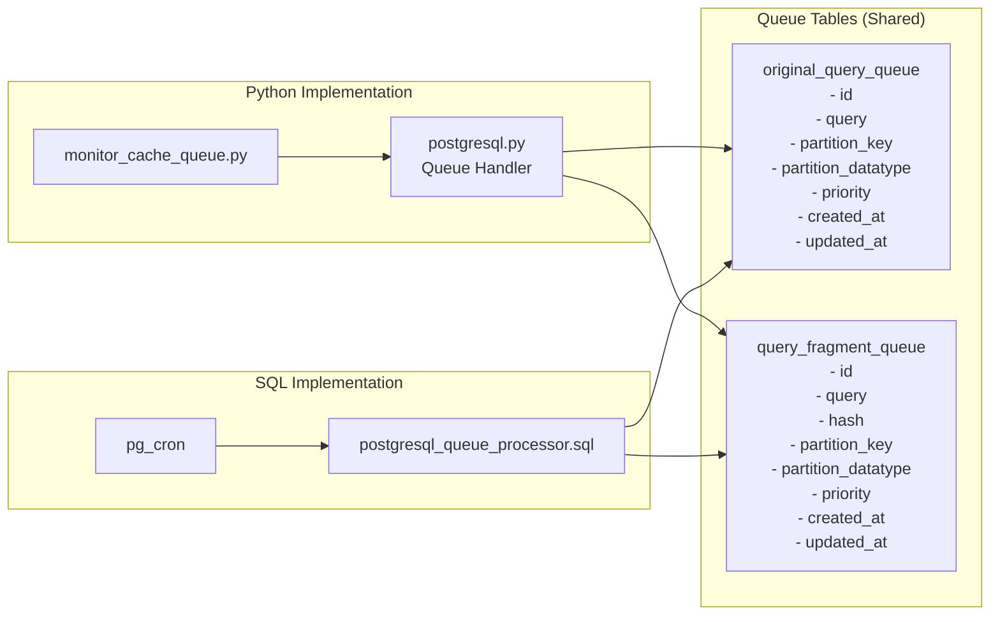

# PartitionCache

## Overview
PartitionCache is a caching middleware for partition-based query optimization in heavily partitioned datasets. This system enables caching of partition identifiers and provides query rewriting capabilities to reduce search space and accelerate query execution.

It is a Python library supporting both CLI and programmatic interfaces, with multiple cache backends and advanced queue-based processing. The system supports PostgreSQL, MySQL, and SQLite as underlying databases, with flexible cache storage options including PostgreSQL, Redis, and RocksDB.

### Key Features

- **Multi-Partition Support**: Manage multiple partition keys with different datatypes simultaneously
- **Advanced Cache Backends**: PostgreSQL arrays/bits, Redis sets/bits, RocksDB variants
- **Intelligent Queue System**: Two-tier queue architecture with priority support and blocking operations
- **Database-Native Processing**: PostgreSQL Queue Processor with pg_cron integration for fast cache population
- **Multi-Backend Architecture**: Supports PostgreSQL, Redis, and RocksDB for cache storage
- **Cache Eviction Management**: Automatic cleanup with pg_cron integration
- **Comprehensive CLI Tools**: Complete cache management and monitoring interface

### When to Use PartitionCache

This approach is most effective when your working environment has:
- Complex SQL queries requiring significant computation time (> few milliseconds)
- Read-only or append-only datasets
- Analytical searches across logical partitions (cities, regions, time periods, network segments)
- Queries with conjunctive (AND) conditions that can benefit from intersection operations

## System Architecture

```
┌─────────────────────────────────────────────────────────────────────────────┐
│                           PartitionCache System                             │
├─────────────────────────────────────────────────────────────────────────────┤
│                                                                             │
│  ┌─────────────────┐    ┌─────────────────┐    ┌─────────────────────────┐  │
│  │  Application    │    │  Query          │    │ Cache Storage Layer     │  │
│  │  Layer          │    │  Processing     │    │                         │  │
│  │                 │    │  Layer          │    │ ┌─────────────────────┐ │  │
│  │ ┌─────────────┐ │    │                 │    │ │ PostgreSQL Handlers │ │  │
│  │ │ CLI Tools   │ │    │ ┌─────────────┐ │    │ │ - Array Storage     │ │  │
│  │ │ Python API  │ │───>│ │ Query       │ │───>│ │ - Bit Storage       │ │  │
│  │ │ Helper Objs │ │    │ │ Processor   │ │    │ └─────────────────────┘ │  │
│  │ └─────────────┘ │    │ │ Fragment    │ │    │                         │  │
│  └─────────────────┘    │ │ Generator   │ │    │ ┌─────────────────────┐ │  │
│                         │ └─────────────┘ │    │ │ Redis Handlers      │ │  │
│                         │                 │    │ │ - Set Storage       │ │  │
│                         │ ┌─────────────┐ │    │ │ - Bit Storage       │ │  │
│                         │ │ Cache       │ │    │ └─────────────────────┘ │  │
│                         │ │ Application │ │    │                         │  │
│                         │ │ Engine      │ │    │ ┌─────────────────────┐ │  │
│                         │ └─────────────┘ │    │ │ RocksDB Handlers    │ │  │
│                         └─────────────────┘    │ │ - Set Storage       │ │  │
│                                                │ │ - Bit Storage       │ │  │
│                                                │ │ - Dict Storage      │ │  │
│                                                │ └─────────────────────┘ │  │
│                                                └─────────────────────────┘  │
└─────────────────────────────────────────────────────────────────────────────┘
```

## Quick Start

### Installation

```bash
pip install git+https://github.com/MPoppinga/PartitionCache@main
```

### Basic Usage

```python
import partitioncache

# Create a cache handler with automatic datatype validation
cache = partitioncache.create_cache_helper("postgresql_array", "user_id", "integer")

# Store partition keys for a query
cache.set_set("query_hash", {1, 2, 3, 4, 5})

# Retrieve partition keys
partition_keys = cache.get("query_hash")  # Returns: {1, 2, 3, 4, 5}

# Get partition keys for a complex query
partition_keys, subqueries, hits = partitioncache.get_partition_keys(
    query="SELECT * FROM users WHERE age > 25",
    cache_handler=cache.underlying_handler,
    partition_key="user_id"
)

# Extend query with cached partition keys
optimized_query = partitioncache.extend_query_with_partition_keys(
    query="SELECT * FROM users WHERE age > 25",
    partition_keys=partition_keys,
    partition_key="user_id"
)

# Alternative: Use the high-performance lazy cache approach (recommended)
enhanced_query, stats = partitioncache.apply_cache_lazy(
    query="SELECT * FROM users WHERE age > 25",
    cache_handler=cache.underlying_handler,
    partition_key="user_id"
)
print(f"Cache hits: {stats['cache_hits']}/{stats['generated_variants']}")
```

### Environment Setup

Create a `.env` file with your configuration:

```bash
# Database Configuration
DB_HOST=localhost
DB_PORT=5432
DB_USER=app_user
DB_PASSWORD=secure_password
DB_NAME=application_db

# Cache Backend (recommended for most use cases)
CACHE_BACKEND=postgresql_array
PG_ARRAY_CACHE_TABLE_PREFIX=app_cache_array

# Queue Configuration (for asynchronous processing)
QUERY_QUEUE_PROVIDER=postgresql
PG_QUEUE_HOST=localhost
PG_QUEUE_PORT=5432
PG_QUEUE_USER=app_user
PG_QUEUE_PASSWORD=secure_password
PG_QUEUE_DB=application_db
PG_QUEUE_TABLE_PREFIX=app_queue_
```

## Multi-Partition Support

PartitionCache supports multiple partition keys with different datatypes, enabling sophisticated partitioning strategies:

```python
# Create handlers for different partition strategies
city_cache = partitioncache.create_cache_helper("postgresql_array", "city_id", "integer")
region_cache = partitioncache.create_cache_helper("postgresql_array", "region", "text")
coord_cache = partitioncache.create_cache_helper("rocksdict", "coordinates", "float")

# Store data across different partitions
city_cache.set_set("restaurants", {1, 5, 10, 15})
region_cache.set_set("restaurants", {"NYC", "LA", "SF"})
coord_cache.set_set("restaurants", {40.7128, 34.0522, 37.7749})

# Query processing with multiple partitions
for cache, partition_key in [(city_cache, "city_id"), (region_cache, "region")]:
    keys, subq, hits = partitioncache.get_partition_keys(
        query="SELECT * FROM restaurants WHERE rating > 4.0",
        cache_handler=cache.underlying_handler,
        partition_key=partition_key
    )
    print(f"Cached {partition_key} partitions: {keys}")
```

## Cache Backend Selection

| Backend | Integer | Float | Text | Timestamp | Best Use Case |
|---------|---------|-------|------|-----------|---------------|
| **postgresql_array** | ✓ | ✓ | ✓ | ✓ | Production applications, full features |
| **postgresql_bit** | ✓ | ✗ | ✗ | ✗ | Memory-efficient integer storage |
| **redis_set** | ✓ | ✗ | ✓ | ✗ | High-throughput, distributed cache |
| **redis_bit** | ✓ | ✗ | ✗ | ✗ | Memory-efficient Redis cache |
| **rocksdb_set** | ✓ | ✗ | ✓ | ✗ | Development, no external dependencies |
| **rocksdb_bit** | ✓ | ✗ | ✗ | ✗ | Memory-efficient file-based |
| **rocksdict** | ✓ | ✓ | ✓ | ✓ | Development, full datatype support |

```python
# Get available backends and their capabilities
backends = partitioncache.list_cache_types()
print(backends["postgresql_array"])  # ['integer', 'float', 'text', 'timestamp']
```

## Processing Models

### 1. Direct Cache Access (Synchronous)

For immediate results and simple use cases:

```python
import partitioncache

# Direct cache operations
cache = partitioncache.create_cache_helper("postgresql_array", "city_id", "integer")

# Store query results directly
cache.set_set("expensive_query_hash", {1, 5, 10, 15})

# Retrieve and use
if cache.exists("expensive_query_hash"):
    cached_cities = cache.get("expensive_query_hash")
    optimized_query = partitioncache.extend_query_with_partition_keys(
        "SELECT * FROM restaurants WHERE rating > 4.0",
        cached_cities,
        "city_id"
    )
```

### 2. Queue-Based Processing (Asynchronous)

For background processing and complex workloads:

```python
# Add queries to processing queue
success = partitioncache.push_to_original_query_queue(
    "SELECT DISTINCT city_id FROM restaurants WHERE rating > 4.0",
    partition_key="city_id",
    partition_datatype="integer"
)

# Monitor queue status
lengths = partitioncache.get_queue_lengths()
print(f"Pending: {lengths['query_fragment_queue']} fragments")
```

### 3. PostgreSQL Queue Processor (Recommended)

Database-native processing with pg_cron:

```bash
# Setup PostgreSQL queue processor (one-time)
python -m partitioncache.cli.setup_postgresql_queue_processor setup

# Enable real-time processing
python -m partitioncache.cli.setup_postgresql_queue_processor enable

# Configure for your workload
python -m partitioncache.cli.setup_postgresql_queue_processor config --max-jobs 10 --frequency 2

# Monitor processing
python -m partitioncache.cli.setup_postgresql_queue_processor status
python -m partitioncache.cli.setup_postgresql_queue_processor logs --limit 20
```


## Advanced API Examples

### Lazy Cache Application (Recommended)

The most efficient way to apply PartitionCache is using the `apply_cache_lazy` function, which provides optimal performance by using lazy SQL subqueries directly from the cache:

```python
import partitioncache

# Setup cache handler that supports lazy intersection
cache = partitioncache.create_cache_helper("postgresql_array", "user_id", "integer")

# Single function call handles the entire cache workflow
enhanced_query, stats = partitioncache.apply_cache_lazy(
    query="SELECT * FROM orders WHERE status = 'pending' AND total > 100",
    cache_handler=cache.underlying_handler,
    partition_key="user_id",
    method="TMP_TABLE_IN",  # Options: "IN_SUBQUERY", "TMP_TABLE_IN", "TMP_TABLE_JOIN"
    p0_alias="o"  # Table alias (auto-detected if not specified)
)

print(f"Enhanced query ready for execution: {len(enhanced_query)} characters")
print(f"Cache performance: {stats['cache_hits']} hits from {stats['generated_variants']} subqueries")
print(f"Query enhanced: {'Yes' if stats['enhanced'] else 'No'}")

# Execute the optimized query directly
# enhanced_query now contains the complete optimized SQL
```

**Key Benefits:**
- **Single Function Call**: Replaces manual cache lookup and query combination
- **Optimal Performance**: Uses lazy SQL subqueries, no duplicate hash generation
- **Multiple Integration Methods**: Choose optimal method for your database engine
- **Comprehensive Statistics**: Built-in cache hit reporting

### Available Integration Methods

```python
# Method 1: Direct subquery integration (fastest for simple queries)
enhanced_query, stats = partitioncache.apply_cache_lazy(
    query="SELECT * FROM products WHERE category = 'electronics'",
    cache_handler=cache.underlying_handler,
    partition_key="store_id",
    method="IN_SUBQUERY"  # Creates: WHERE store_id IN (SELECT store_id FROM cache...)
)

# Method 2: Temporary table with IN clause (best for complex queries)
enhanced_query, stats = partitioncache.apply_cache_lazy(
    query="SELECT * FROM products WHERE category = 'electronics'",
    cache_handler=cache.underlying_handler,
    partition_key="store_id",
    method="TMP_TABLE_IN",  # Creates temp table, then: WHERE store_id IN (SELECT...)
    analyze_tmp_table=True  # Enables indexing and statistics for better performance
)

# Method 3: Temporary table with JOIN (optimal for large result sets)
enhanced_query, stats = partitioncache.apply_cache_lazy(
    query="SELECT p.*, s.name FROM products p JOIN stores s ON p.store_id = s.id",
    cache_handler=cache.underlying_handler,
    partition_key="store_id",
    method="TMP_TABLE_JOIN"  # Creates temp table and JOINs it to all tables
)
```

### Intelligent Query Optimization

```python
import partitioncache

def optimize_user_query(base_query, user_id_filter=None):
    """Demonstrate query optimization with cached partition keys."""
    
    # Setup cache
    cache = partitioncache.create_cache_helper("postgresql_array", "user_id", "integer")
    
    # Check for cached partition keys
    partition_keys, subqueries, cache_hits = partitioncache.get_partition_keys(
        query=base_query,
        cache_handler=cache.underlying_handler,
        partition_key="user_id"
    )
    
    print(f"Cache analysis: {cache_hits} hits from {subqueries} subqueries")
    
    if partition_keys:
        # Apply additional filters if provided
        if user_id_filter:
            partition_keys = partition_keys.intersection(user_id_filter)
            
        # Generate optimized query
        optimized_query = partitioncache.extend_query_with_partition_keys(
            query=base_query,
            partition_keys=partition_keys,
            partition_key="user_id",
            method="IN"  # or "EXISTS" for complex cases
        )
        
        print(f"Optimized query targets {len(partition_keys)} user partitions")
        return optimized_query
    else:
        print("No cached data available, using original query")
        return base_query

# Usage
optimized = optimize_user_query(
    "SELECT * FROM orders WHERE status = 'pending'",
    user_id_filter={1, 2, 3, 4, 5}  # Optional additional filtering
)
```

### Multi-Level Caching Strategy

```python
def implement_hierarchical_caching():
    """Demonstrate hierarchical partition caching."""
    
    # Create caches for different granularities
    city_cache = partitioncache.create_cache_helper("postgresql_array", "city_id", "integer")
    region_cache = partitioncache.create_cache_helper("postgresql_array", "region_id", "integer") 
    country_cache = partitioncache.create_cache_helper("postgresql_array", "country_id", "integer")
    
    # Store hierarchical data
    query_hash = "restaurants_rating_4plus"
    
    city_cache.set_set(query_hash, {1, 5, 10, 15, 20})      # Cities with good restaurants
    region_cache.set_set(query_hash, {1, 3, 7})             # Regions containing those cities
    country_cache.set_set(query_hash, {1, 2})               # Countries containing those regions
    
    # Query optimization with fallback hierarchy
    def get_optimized_query(query, target_level="city"):
        caches = {
            "city": (city_cache, "city_id"),
            "region": (region_cache, "region_id"),  
            "country": (country_cache, "country_id")
        }
        
        cache, partition_key = caches[target_level]
        
        if cache.exists(query_hash):
            partition_keys = cache.get(query_hash)
            return partitioncache.extend_query_with_partition_keys(
                query, partition_keys, partition_key
            )
        
        # Fallback to higher level if available
        if target_level == "city" and region_cache.exists(query_hash):
            return get_optimized_query(query, "region")
        elif target_level == "region" and country_cache.exists(query_hash):
            return get_optimized_query(query, "country")
        
        return query  # No optimization available
    
    return get_optimized_query

# Usage
get_query = implement_hierarchical_caching()
optimized = get_query("SELECT * FROM restaurants WHERE cuisine = 'italian'", "city")
```

## CLI Usage

### Cache Population

```bash
# Add single query directly to cache
pcache-add \
    --direct \
    --query "SELECT DISTINCT city_id FROM restaurants WHERE rating > 4.0" \
    --partition-key "city_id" \
    --partition-datatype "integer" \
    --cache-backend "postgresql_array"

# Add to processing queue for background processing
pcache-add \
    --queue-original \
    --query "SELECT DISTINCT city_id FROM restaurants WHERE rating > 4.0" \
    --partition-key "city_id" \
    --partition-datatype "integer"

# Process from file
pcache-add \
    --direct \
    --query-file "complex_queries.sql" \
    --partition-key "region_id" \
    --partition-datatype "integer" \
    --cache-backend "postgresql_array"
```

### Queue Management

```bash
# Monitor queue processing (traditional external monitor)
pcache-observer \
    --cache-backend "postgresql_array" \
    --max-processes 8

# PostgreSQL queue processor management (recommended)
pcache-postgresql-queue-processor status
pcache-postgresql-queue-processor logs --limit 50
pcache-postgresql-queue-processor config --max-jobs 15 --frequency 1
```

### Cache Operations

```bash
# Retrieve cached data
pcache-get \
    --query "SELECT * FROM restaurants WHERE rating > 4.0" \
    --partition-key "city_id" \
    --partition-datatype "integer" \
    --cache-backend "postgresql_array" \
    --output-format json

# Cache management (uses CACHE_BACKEND from environment)
pcache-manage cache count
pcache-manage maintenance prune --days 30
pcache-manage maintenance partition --delete "old_cities"
```

## Real-World Example: OpenStreetMap POI Search

"Find all cities where public parks larger than 1000 m² exist within 50m of a street named 'Main Street'."

### Step 1: Initial Query Processing

```python
# Process the expensive geospatial query
original_query = """
SELECT DISTINCT city_id 
FROM pois p
JOIN streets s ON ST_DWithin(p.geom, s.geom, 50)
WHERE p.type = 'park' 
  AND p.area > 1000 
  AND s.name ILIKE '%main street%'
"""

# Add to cache
cache = partitioncache.create_cache_helper("postgresql_array", "city_id", "integer")
cache.set_set("parks_near_main_street", {1, 5, 10, 15, 22, 30})
```

### Step 2: Optimized Follow-up Queries (Traditional Approach)

```python
# Later query: "Find schools in European cities near parks and Main Street"
europe_cities = {1, 5, 15, 18, 22, 25, 30, 35}  # Cities in Europe

# Get cached park data
cached_park_cities = cache.get("parks_near_main_street")

# Intersection: only search cities that have both parks AND are in Europe
target_cities = cached_park_cities.intersection(europe_cities)  # {1, 5, 15, 22, 30}

# Generate optimized query
school_query = partitioncache.extend_query_with_partition_keys(
    query="""
    SELECT school_id, name, city_id 
    FROM schools 
    WHERE type = 'primary'
    """,
    partition_keys=target_cities,
    partition_key="city_id"
)

print(f"Optimized query will only search {len(target_cities)} cities instead of all cities")
```

### Step 2 Alternative: Using `apply_cache_lazy` (Recommended)

```python
# Later query: "Find schools in European cities near parks and Main Street"
# Using the modern high-performance approach with apply_cache_lazy

cache = partitioncache.create_cache_helper("postgresql_array", "city_id", "integer")

# Single function call handles cache lookup and query optimization
enhanced_school_query, stats = partitioncache.apply_cache_lazy(
    query="""
    SELECT school_id, name, city_id 
    FROM schools s
    WHERE type = 'primary'
    """,
    cache_handler=cache.underlying_handler,
    partition_key="city_id",
    method="TMP_TABLE_IN",  # Optimal for complex geospatial queries
    p0_alias="s"
)

print(f"Cache performance: {stats['cache_hits']} hits from {stats['generated_variants']} subqueries")
if stats['enhanced']:
    print(f"Query optimized with lazy SQL subquery - ready for execution")
    # enhanced_school_query now contains the complete optimized SQL
    # No manual intersection or query rewriting needed
else:
    print("No cache hits found, using original query")

# Performance benefit: No duplicate hash generation, optimal lazy subquery integration
```

### Step 3: Production Deployment

```bash
# Complete example setup
cd examples/openstreetmap_poi

# Setup environment
cp .env.example .env
# Edit .env with your database credentials

# Initialize direct processor
python -m partitioncache.cli.setup_postgresql_queue_processor setup

# Enable real-time processing
python -m partitioncache.cli.setup_postgresql_queue_processor enable

# Run the example
python process_osm_data.py
python run_poi_queries.py
```

## Performance Optimization Notes

### Lazy Cache Application (`apply_cache_lazy`)

The `apply_cache_lazy` function includes several performance optimizations:

1. **Single Hash Generation**: Eliminates duplicate `generate_all_hashes` calls that were present in manual approaches
2. **Lazy SQL Subqueries**: Uses database-native subqueries instead of materializing partition key sets in Python
3. **Optimized Integration Methods**: Choose the best method for your query complexity:
   - `IN_SUBQUERY`: Direct integration, fastest for simple queries
   - `TMP_TABLE_IN`: Best for complex queries with many conditions
   - `TMP_TABLE_JOIN`: Optimal for large result sets and complex joins

```python
# Before: Manual approach with performance overhead
lazy_subquery, generated_variants, used_hashes = partitioncache.get_partition_keys_lazy(...)
if lazy_subquery:
    enhanced_query = partitioncache.extend_query_with_partition_keys_lazy(...)

# After: Optimized single function call
enhanced_query, stats = partitioncache.apply_cache_lazy(...)
```

**Performance Improvements:**
- ~50% reduction in hash generation overhead
- Lazy evaluation reduces memory usage
- Better database query plan optimization with subqueries

## Best Practices

### 1. Cache Backend Selection

```python
# For production applications with complex datatypes
cache = partitioncache.create_cache_helper("postgresql_array", "user_id", "integer")

# For memory-constrained environments with integer partitions
cache = partitioncache.create_cache_helper("postgresql_bit", "user_id", "integer")

# For high-throughput applications
cache = partitioncache.create_cache_helper("redis_set", "session_id", "text")

# For development and testing
cache = partitioncache.create_cache_helper("rocksdict", "test_id", "integer")
```

### 2. Error Handling

```python
def robust_cache_operation(cache, operation_func, *args, **kwargs):
    """Implement robust cache operations with proper error handling."""
    try:
        result = operation_func(*args, **kwargs)
        if result is False:  # Operation failed
            logger.warning(f"Cache operation failed: {operation_func.__name__}")
            return None
        return result
    except Exception as e:
        logger.error(f"Cache error in {operation_func.__name__}: {e}")
        return None

# Usage
cached_data = robust_cache_operation(cache, cache.get, "query_hash")
if cached_data is not None:
    # Use cached data
    pass
else:
    # Fallback to direct query execution
    pass
```

### 3. Performance Monitoring

```python
import time
from functools import wraps

def cache_performance_monitor(func):
    """Monitor cache operation performance."""
    @wraps(func)
    def wrapper(*args, **kwargs):
        start_time = time.time()
        result = func(*args, **kwargs)
        duration = time.time() - start_time
        
        logger.info(f"Cache operation {func.__name__} took {duration:.3f}s")
        if duration > 1.0:  # Log slow operations
            logger.warning(f"Slow cache operation: {func.__name__} ({duration:.3f}s)")
        
        return result
    return wrapper

# Apply to cache operations
@cache_performance_monitor
def get_cached_partitions(cache, query_hash):
    return cache.get(query_hash)
```

## Documentation

### Core Architecture
- **[System Overview](docs/system_overview.md)** - Complete system architecture with configuration diagrams
- **[Cache Handlers](docs/cache_handlers.md)** - Advanced cache management and multi-partition support
- **[Queue System](docs/queue_system.md)** - Understanding the dual queue architecture

### Examples and Workflows
- **[Complete Workflow Example](docs/complete_workflow_example.md)** - End-to-end demonstration with OpenStreetMap POI data
- **[PartitionCache Management CLI](docs/manage_cache_cli.md)** - Comprehensive CLI usage guide

### Advanced Features
- **[PostgreSQL Queue Processor](docs/postgresql_queue_processor.md)** - Database-native processing with pg_cron (recommended for production)
- **[Cache Eviction](docs/cache_eviction.md)** - Automatic cache cleanup and management
- **[Datatype Support](docs/datatype_support.md)** - Comprehensive datatype handling across backends

### Development & Testing
- **[Integration Test Guide](docs/integration_test_guide.md)** - Testing documentation and CI/CD setup

### Quick Reference
For production deployments, the **PostgreSQL Queue Processor** is strongly recommended as it provides:
- Zero external dependencies (everything runs in PostgreSQL)
- Real-time processing with modern pg_cron second-level scheduling (1-59 seconds)
- Comprehensive monitoring, logging, and error handling
- Automatic configuration detection from environment variables
- Built-in concurrency control and job recovery

## License

PartitionCache is licensed under the GNU Lesser General Public License v3.0.

See [COPYING](COPYING) and [COPYING.LESSER](COPYING.LESSER) for more details.

## Prerequisites

### PostgreSQL Extensions

PartitionCache requires a PostgreSQL instance with the following extensions for full functionality:

#### 🔧 **pg_cron** (Required for Queue Processing)
- **Purpose**: Database-native query processing and scheduling
- **Used by**: PostgreSQL Queue Processor, automatic cache population
- **Installation**: `sudo apt-get install postgresql-16-cron`
- **Configuration**: Add `shared_preload_libraries = 'pg_cron'` to postgresql.conf

#### 🔧 **roaringbitmap** (Required for RoaringBit Cache Handler)
- **Purpose**: High-performance compressed bitmap operations  
- **Used by**: `postgresql_roaringbit` cache backend
- **Installation**: Use provided script `./scripts/install_pg_extensions.sh postgresql_roaringbit`
- **Alternative**: Manual build from [pg_roaringbitmap](https://github.com/ChenHuajun/pg_roaringbitmap)

#### ⚡ **Quick Setup with Docker**

Use our pre-built image with all extensions:

```bash
# Option 1: Build locally using our script
./scripts/build_postgres_image.sh

# Option 2: Pull latest stable from GitHub Container Registry
docker pull ghcr.io/mpoppinga/postgres-test-extensions:main

# Option 3: Build manually
cd .github/docker/postgres-cron
docker build -t postgres-test-extensions:latest .

# Run PostgreSQL with all extensions
docker run -d \
  --name postgres-partitioncache \
  -e POSTGRES_DB=your_db \
  -e POSTGRES_USER=your_user \
  -e POSTGRES_PASSWORD=your_password \
  -p 5432:5432 \
  ghcr.io/mpoppinga/postgres-test-extensions:main
```

#### Example Workload

- **OpenStreetMap POI Search**: [examples/openstreetmap_poi/README.md](examples/openstreetmap_poi/README.md)

