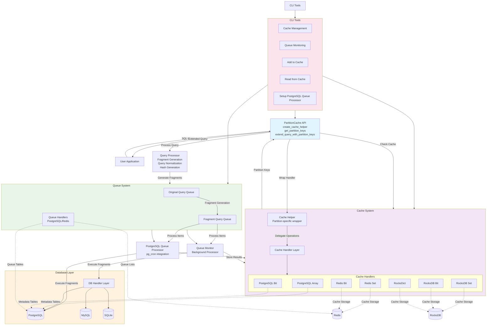
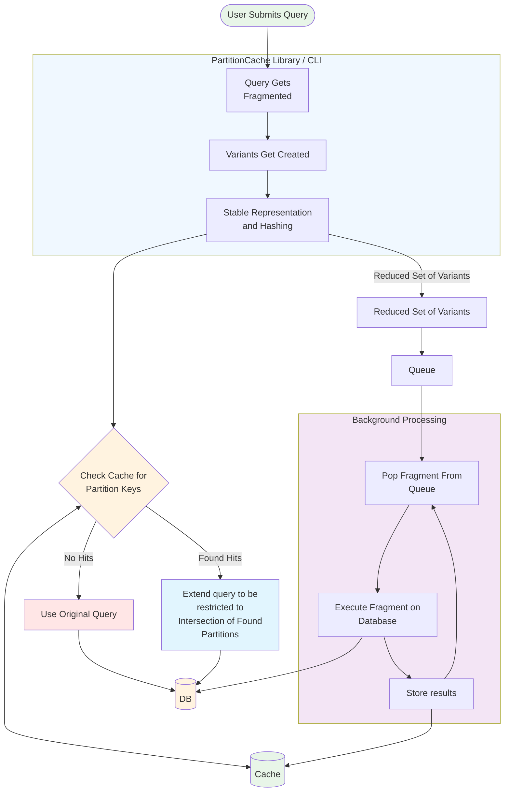

# PartitionCache Documentation

This directory contains the technical documentation for PartitionCache, a caching middleware for partition-based query optimization.

## Documentation Structure

### Core Documentation

#### [System Overview](system_overview.md)
**Primary Entry Point** - Comprehensive high-level guide covering:
- Complete system architecture with diagrams
- Streamlined API usage and examples
- Configuration management and environment variables
- Performance characteristics and benchmarks
- Use case recommendations and best practices
- CLI tools and management interfaces
- Security considerations and migration paths

#### [Cache Handlers](cache_handlers.md) 
**Backend Reference** - Detailed cache backend documentation:
- All supported cache backends (PostgreSQL, Redis, RocksDB)
- Multi-partition support and datatype management
- Performance characteristics and memory efficiency
- Backend-specific features and API reference
- Migration and troubleshooting guides

#### [Queue System](queue_system.md)
**Queue Architecture** - Two-queue system documentation:
- Queue providers (PostgreSQL and Redis)
- Priority processing and concurrency control
- LISTEN/NOTIFY support and real-time processing
- CLI tools and management operations
- Performance tuning and monitoring

#### [PostgreSQL Queue Processor](postgresql_queue_processor.md)
**Modern Processing** - Database-native processing documentation:
- pg_cron integration and automated scheduling
- Comprehensive monitoring and logging
- Concurrency control and error recovery
- Installation, configuration, and troubleshooting
- Performance optimization and best practices

#### [Datatype Support](datatype_support.md)
**Reference Guide** - Compatibility matrix and datatype information:
- Backend datatype support matrix
- Conversion guidelines and recommendations
- Performance implications of different datatypes
- Usage examples and best practices

#### [Integration Test Guide](integration_test_guide.md)
**Testing Documentation** - Comprehensive testing guide:
- Test structure and coverage
- Local and CI/CD execution differences
- Environment setup and dependencies
- Running specific test suites
- Troubleshooting and debugging

## Quick Start Guide

### 1. System Overview
Start with [System Overview](system_overview.md) for architecture understanding and API introduction.

### 2. Choose Your Backend
Consult [Cache Handlers](cache_handlers.md) to select the optimal cache backend for your use case:
- **PostgreSQL Array**: Mixed datatypes, full SQL features
- **PostgreSQL Bit**: Integer-only, memory efficient
- **Redis**: Distributed, high throughput
- **RocksDB**: File-based, development/embedded

### 3. Configuration
Follow the configuration examples in [System Overview](system_overview.md) for environment setup.

### 4. Processing Model
Choose between:
- **PostgreSQL Queue Processor**: Modern, database-native ([PostgreSQL Queue Processor](postgresql_queue_processor.md))
- **Monitor Processing**: Traditional, external scripts ([Queue System](queue_system.md))

### 5. Implementation
Use the streamlined API examples throughout the documentation for implementation.

## Documentation Philosophy

This documentation has been restructured to:
- **Eliminate Duplication**: Each topic is covered comprehensively in one place
- **Focus on Current State**: No references to old versions or historical changes
- **Provide Practical Guidance**: Emphasis on implementation and best practices
- **Include Comprehensive Diagrams**: Visual representations of system architecture
- **Maintain Accuracy**: All information reflects the current codebase state

## Getting Help

- **System Architecture**: See [System Overview](system_overview.md)
- **Backend Selection**: See [Cache Handlers](cache_handlers.md) 
- **Queue Setup**: See [Queue System](queue_system.md)
- **PostgreSQL Queue Processor**: See [PostgreSQL Queue Processor](postgresql_queue_processor.md)
- **Datatype Issues**: See [Datatype Support](datatype_support.md)

For examples and practical workflows, refer to the `examples/` directory in the project root.

