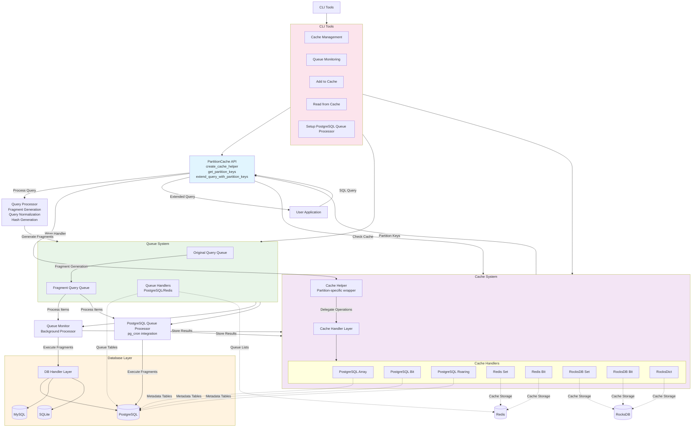
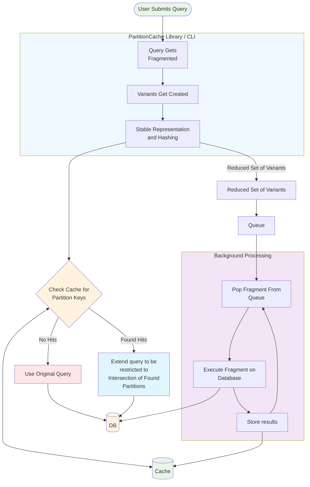
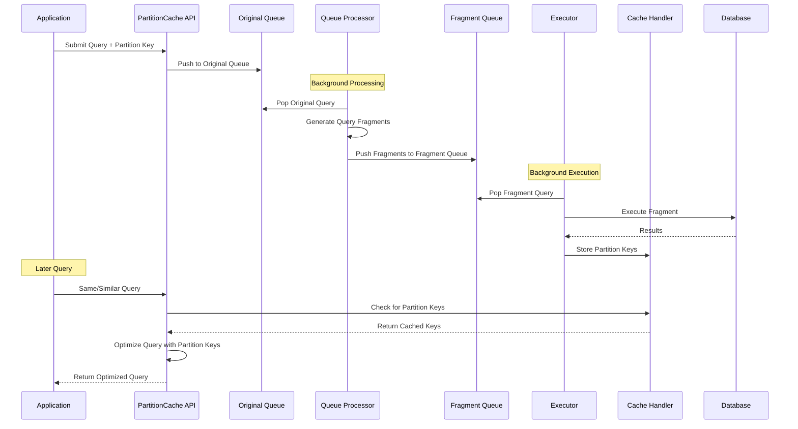
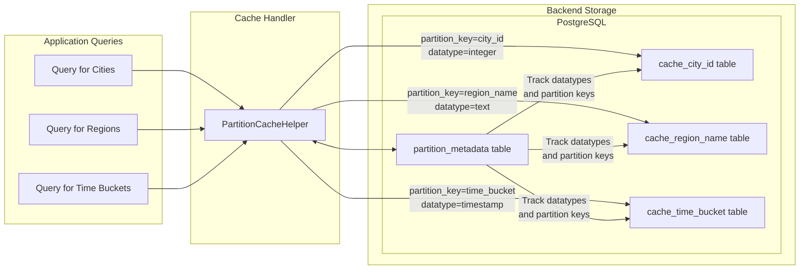
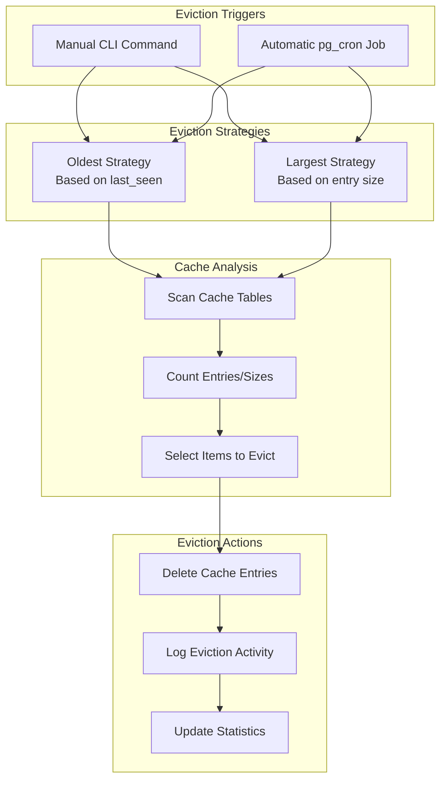

# PartitionCache Architecture Diagrams

This document contains detailed architectural diagrams for PartitionCache components and data flows.

## System Architecture Overview



## Query Processing Flow



## PostgreSQL Queue Processor Architecture

```mermaid
graph TB
    subgraph "PostgreSQL Database"
        subgraph "pg_cron Scheduler"
            Cron1[Worker Job 1<br/>Every N seconds]
            Cron2[Worker Job 2<br/>Every N seconds]
            Cron3[Worker Job N<br/>Every N seconds]
            CronTO[Timeout Job<br/>Every N seconds]
        end
        
        subgraph "Queue Tables"
            OrigQueue[original_query_queue<br/>- id, query<br/>- partition_key, priority]
            FragQueue[query_fragment_queue<br/>- id, query, hash<br/>- partition_key, priority]
        end
        
        subgraph "Processing Tables"
            ActiveJobs[active_jobs<br/>- query_hash, partition_key<br/>- job_id, started_at]
            ProcessorLog[processor_log<br/>- job_id, status<br/>- execution_time_ms, error_message]
            Config[processor_config<br/>- enabled, max_parallel_jobs<br/>- frequency_seconds, timeout_seconds]
        end
        
        subgraph "Cache Tables"
            CacheTable[{prefix}_cache_{partition_key}<br/>- query_hash<br/>- value (array/bit/roaring)]
            QueriesTable[{prefix}_queries<br/>- query_hash, query<br/>- partition_key, last_seen]
        end
        
        subgraph "Processing Functions"
            SingleJob[partitioncache_run_single_job]
            Cleanup[partitioncache_handle_timeouts]
            UpdateConfig[partitioncache_update_processor_config]
            SetEnabled[partitioncache_set_processor_enabled]
        end
    end
    
    %% Flow connections
    Cron1 --> SingleJob
    Cron2 --> SingleJob
    Cron3 --> SingleJob
    CronTO --> Cleanup
    
    SingleJob --> OrigQueue
    SingleJob --> FragQueue
    SingleJob --> ActiveJobs
    SingleJob --> ProcessorLog
    SingleJob --> CacheTable
    SingleJob --> QueriesTable
    
    Cleanup --> ActiveJobs
    Cleanup --> ProcessorLog
    
    UpdateConfig --> Config
    SetEnabled --> Config
    
    %% Styling
    style SingleJob fill:#e1f5fe
    style Cleanup fill:#f3e5f5
    style Status fill:#e8f5e8
```

## Cache Handler Class Hierarchy

```mermaid
classDiagram
    class AbstractCacheHandler {
        <<abstract>>
        +set_set(key, value, partition_key="partition_key") bool
        +set_null(key, partition_key="partition_key") bool
        +set_query(key, query, partition_key="partition_key") bool
        +get(key, partition_key="partition_key") set|None
        +exists(key, partition_key="partition_key") bool
        +is_null(key, partition_key="partition_key") bool
        +delete(key, partition_key="partition_key") bool
        +get_all_keys(partition_key="partition_key") list[str]
        +get_partition_keys() list[tuple[str,str]]
        +filter_existing_keys(keys, partition_key) set
        +get_datatype(partition_key) str|None
        +register_partition_key(partition_key, datatype, **kwargs)
        +get_intersected(keys, partition_key) tuple[set,int]
        +close()
    }
    
    class AbstractCacheHandler_Lazy {
        <<abstract>>
        +get_intersected_lazy(keys, partition_key) tuple[str|None,int]
    }
    
    class PostgreSQLArrayCacheHandler {
        +supported_datatypes: set
        -_ensure_partition_table(partition_key, datatype)
        -_get_cache_table_name(partition_key) str
    }
    
    class PostgreSQLBitCacheHandler {
        +supported_datatypes: set
        -_create_partition_table(partition_key, bitsize)
        -_get_partition_bitsize(partition_key) int
    }
    
    class PostgreSQLRoaringBitCacheHandler {
        +supported_datatypes: set
        -_convert_to_roaring(value) BitMap
    }
    
    class RedisSetCacheHandler {
        +supported_datatypes: set
        -_get_redis_key(key, partition_key) str
    }
    
    class RedisBitCacheHandler {
        +supported_datatypes: set
        -_set_bits(key, value, partition_key)
    }
    
    class RocksDBSetCacheHandler {
        +supported_datatypes: set
        -_get_db_path() str
    }
    
    class RocksDBBitCacheHandler {
        +supported_datatypes: set
        -_convert_to_bitarray(value) bitarray
    }
    
    class RocksDictCacheHandler {
        +supported_datatypes: set
        -_serialize_value(value) bytes
        -_deserialize_value(data) set
    }
    
    AbstractCacheHandler <|-- PostgreSQLArrayCacheHandler
    AbstractCacheHandler <|-- PostgreSQLBitCacheHandler
    AbstractCacheHandler <|-- PostgreSQLRoaringBitCacheHandler
    AbstractCacheHandler <|-- RedisSetCacheHandler
    AbstractCacheHandler <|-- RedisBitCacheHandler
    AbstractCacheHandler <|-- RocksDBSetCacheHandler
    AbstractCacheHandler <|-- RocksDBBitCacheHandler
    AbstractCacheHandler <|-- RocksDictCacheHandler
    
    AbstractCacheHandler_Lazy <|-- PostgreSQLArrayCacheHandler
    AbstractCacheHandler_Lazy <|-- PostgreSQLRoaringBitCacheHandler
```



## Queue System Data Flow



## Multi-Partition Support Architecture



## Cache Eviction System



These diagrams provide visual representation of PartitionCache's architecture, data flows, and component relationships. Each diagram focuses on a specific aspect of the system to aid understanding and implementation.