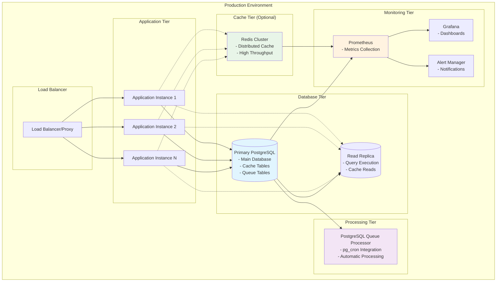
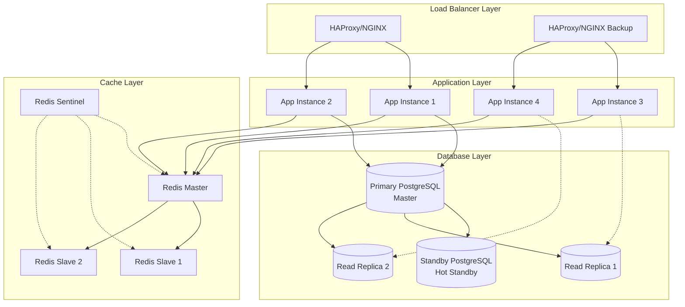
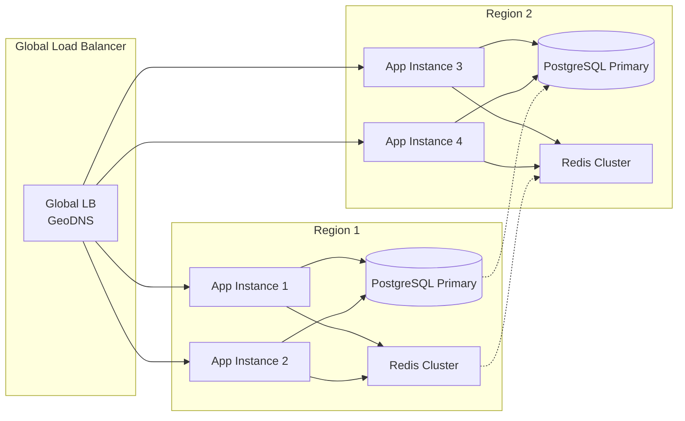

# Production Deployment Guide

This guide covers best practices for deploying PartitionCache in production environments, including infrastructure setup, monitoring, security, and operational considerations.

## Architecture Overview



## Deployment Strategies

### 1. PostgreSQL-Only Deployment (Recommended)

Simplest and most reliable setup using only PostgreSQL.

```yaml
# docker-compose.production.yml
version: '3.8'
services:
  postgres:
    image: postgres:16
    environment:
      POSTGRES_DB: partitioncache_prod
      POSTGRES_USER: partitioncache_user
      POSTGRES_PASSWORD: ${POSTGRES_PASSWORD}
      POSTGRES_INITDB_ARGS: --auth-host=scram-sha-256
    volumes:
      - postgres_data:/var/lib/postgresql/data
      - ./init-scripts:/docker-entrypoint-initdb.d
    command: |
      postgres
      -c shared_preload_libraries=pg_cron
      -c cron.database_name=partitioncache_prod
      -c log_statement=all
      -c log_min_duration_statement=1000
    ports:
      - "5432:5432"
    deploy:
      resources:
        limits:
          memory: 4G
          cpus: '2'
    healthcheck:
      test: ["CMD-SHELL", "pg_isready -U partitioncache_user -d partitioncache_prod"]
      interval: 30s
      timeout: 10s
      retries: 3

  app:
    image: your-app:latest
    environment:
      - DB_HOST=postgres
      - DB_PORT=5432
      - DB_NAME=partitioncache_prod
      - DB_USER=partitioncache_user
      - DB_PASSWORD=${POSTGRES_PASSWORD}
      - CACHE_BACKEND=postgresql_array
      - QUERY_QUEUE_PROVIDER=postgresql
    depends_on:
      postgres:
        condition: service_healthy
    deploy:
      replicas: 3
      resources:
        limits:
          memory: 1G
          cpus: '1'

volumes:
  postgres_data:
```

### 2. High-Performance Deployment with Redis

For high-throughput applications requiring distributed caching.

```yaml
# docker-compose.redis.yml
version: '3.8'
services:
  postgres:
    # Same as above
    
  redis:
    image: redis:7-alpine
    command: redis-server --appendonly yes --maxmemory 2gb --maxmemory-policy allkeys-lru
    volumes:
      - redis_data:/data
    ports:
      - "6379:6379"
    deploy:
      resources:
        limits:
          memory: 2G
          cpus: '1'

  app:
    image: your-app:latest
    environment:
      # PostgreSQL for queue and metadata
      - DB_HOST=postgres
      - QUERY_QUEUE_PROVIDER=postgresql
      # Redis for high-performance cache
      - CACHE_BACKEND=redis_set
      - REDIS_HOST=redis
      - REDIS_PORT=6379
    depends_on:
      - postgres
      - redis

volumes:
  postgres_data:
  redis_data:
```

### 3. Enterprise Deployment with High Availability



## Infrastructure Setup

### 1. PostgreSQL Configuration

#### Primary Database Setup

```sql
-- postgresql.conf
shared_preload_libraries = 'pg_cron'
cron.database_name = 'partitioncache_prod'

# Performance tuning
max_connections = 200
shared_buffers = 1GB
effective_cache_size = 4GB
work_mem = 4MB
maintenance_work_mem = 256MB

# Logging
log_statement = 'mod'
log_min_duration_statement = 1000
log_checkpoints = on
log_lock_waits = on

# Replication (if using replicas)
wal_level = replica
max_wal_senders = 3
wal_keep_size = 1GB
```

#### Extensions Installation

```sql
-- Install required extensions
CREATE EXTENSION IF NOT EXISTS pg_cron;
CREATE EXTENSION IF NOT EXISTS roaringbitmap; -- If using roaring bitmaps

-- Grant permissions
GRANT USAGE ON SCHEMA cron TO partitioncache_user;
```

### 2. Redis Configuration (Optional)

```conf
# redis.conf for production
bind 0.0.0.0
port 6379
timeout 300
keepalive 60

# Memory management
maxmemory 4gb
maxmemory-policy allkeys-lru

# Persistence
save 900 1
save 300 10
save 60 10000
appendonly yes
appendfsync everysec

# Security
requirepass your_redis_password
```

### 3. Application Configuration

#### Environment Variables

```bash
# .env.production
# Database Configuration
DB_HOST=postgres-primary.internal
DB_PORT=5432
DB_USER=partitioncache_user
DB_PASSWORD=${POSTGRES_PASSWORD}
DB_NAME=partitioncache_prod

# SSL Configuration
DB_SSLMODE=require
DB_SSLCERT=/certs/client-cert.pem
DB_SSLKEY=/certs/client-key.pem
DB_SSLROOTCERT=/certs/ca-cert.pem

# Cache Backend
CACHE_BACKEND=postgresql_array
PG_ARRAY_CACHE_TABLE_PREFIX=prod_cache_

# Queue Configuration  
QUERY_QUEUE_PROVIDER=postgresql
PG_QUEUE_HOST=postgres-primary.internal
PG_QUEUE_PORT=5432
PG_QUEUE_USER=partitioncache_user
PG_QUEUE_PASSWORD=${POSTGRES_PASSWORD}
PG_QUEUE_DB=partitioncache_prod
PG_QUEUE_TABLE_PREFIX=prod_queue_

# Optional Redis Configuration
REDIS_HOST=redis-cluster.internal
REDIS_PORT=6379
REDIS_PASSWORD=${REDIS_PASSWORD}
REDIS_CACHE_DB=0

# Performance Tuning
PG_ARRAY_CACHE_CONNECTION_POOL_SIZE=10
PG_QUEUE_CONNECTION_POOL_SIZE=5

# Monitoring
ENABLE_METRICS=true
METRICS_PORT=9090
LOG_LEVEL=INFO
```

## Security Hardening

### 1. Database Security

#### User Permissions

```sql
-- Create dedicated users with minimal permissions
CREATE USER partitioncache_app WITH PASSWORD 'secure_app_password';
CREATE USER partitioncache_queue WITH PASSWORD 'secure_queue_password';

-- Grant minimal required permissions
GRANT CONNECT ON DATABASE partitioncache_prod TO partitioncache_app;
GRANT USAGE ON SCHEMA public TO partitioncache_app;

-- Cache table permissions
GRANT SELECT, INSERT, UPDATE, DELETE ON ALL TABLES IN SCHEMA public TO partitioncache_app;
GRANT USAGE, SELECT ON ALL SEQUENCES IN SCHEMA public TO partitioncache_app;

-- Queue permissions (separate user)
GRANT SELECT, INSERT, UPDATE, DELETE ON TABLE original_query_queue TO partitioncache_queue;
GRANT SELECT, INSERT, UPDATE, DELETE ON TABLE query_fragment_queue TO partitioncache_queue;
GRANT USAGE ON SCHEMA cron TO partitioncache_queue;
```

#### Network Security

```bash
# PostgreSQL host-based authentication (pg_hba.conf)
# TYPE  DATABASE        USER            ADDRESS                 METHOD
local   all             postgres                                peer
host    partitioncache_prod  partitioncache_app   10.0.0.0/8    scram-sha-256
host    partitioncache_prod  partitioncache_queue 10.0.0.0/8    scram-sha-256
hostssl all             all             0.0.0.0/0               scram-sha-256

# Firewall rules (iptables)
iptables -A INPUT -p tcp --dport 5432 -s 10.0.0.0/8 -j ACCEPT
iptables -A INPUT -p tcp --dport 5432 -j DROP
```

### 2. Application Security

#### Connection Security

```python
# Secure connection configuration
import ssl
import psycopg2

def get_secure_connection():
    return psycopg2.connect(
        host=os.getenv('DB_HOST'),
        port=os.getenv('DB_PORT'),
        database=os.getenv('DB_NAME'),
        user=os.getenv('DB_USER'),
        password=os.getenv('DB_PASSWORD'),
        sslmode='require',
        sslcert='/certs/client-cert.pem',
        sslkey='/certs/client-key.pem',
        sslrootcert='/certs/ca-cert.pem',
        connect_timeout=10,
        application_name='partitioncache-prod'
    )
```

#### Input Validation

```python
# Query validation and sanitization
import re
from sqlparse import parse

def validate_query(query: str) -> bool:
    """Validate query for security and safety."""
    # Block dangerous SQL operations
    dangerous_patterns = [
        r'\b(DROP|TRUNCATE|DELETE)\s+(?!.*WHERE)',
        r'\b(ALTER|CREATE|GRANT|REVOKE)\b',
        r'--[^\n]*\n',  # Comments
        r'/\*.*?\*/',   # Block comments
    ]
    
    for pattern in dangerous_patterns:
        if re.search(pattern, query, re.IGNORECASE):
            return False
    
    # Validate SQL syntax
    try:
        parsed = parse(query)
        return len(parsed) == 1 and parsed[0].get_type() == 'SELECT'
    except:
        return False
```

## Monitoring and Observability

### 1. Application Metrics

#### Prometheus Metrics

```python
# metrics.py
from prometheus_client import Counter, Histogram, Gauge, start_http_server

# Cache metrics
cache_hits = Counter('partitioncache_hits_total', 'Cache hits', ['backend', 'partition_key'])
cache_misses = Counter('partitioncache_misses_total', 'Cache misses', ['backend', 'partition_key'])
cache_operations = Histogram('partitioncache_operation_duration_seconds', 'Operation duration', ['operation', 'backend'])

# Queue metrics
queue_depth = Gauge('partitioncache_queue_depth', 'Queue depth', ['queue_type'])
processing_time = Histogram('partitioncache_processing_duration_seconds', 'Processing time')

# Database metrics
db_connections = Gauge('partitioncache_db_connections', 'Database connections', ['pool'])
query_duration = Histogram('partitioncache_query_duration_seconds', 'Query duration')

def start_metrics_server(port=9090):
    start_http_server(port)
```

#### Custom Monitoring

```sql
-- Monitoring queries for PostgreSQL
-- Queue monitoring
CREATE OR REPLACE VIEW partitioncache_monitoring AS
SELECT 
    'queue_original' as metric,
    COUNT(*) as value,
    NOW() as timestamp
FROM original_query_queue
UNION ALL
SELECT 
    'queue_fragment' as metric,
    COUNT(*) as value,
    NOW() as timestamp
FROM query_fragment_queue
UNION ALL
SELECT 
    'active_jobs' as metric,
    COUNT(*) as value,
    NOW() as timestamp
FROM partitioncache_active_jobs;

-- Performance monitoring
CREATE OR REPLACE VIEW partitioncache_performance AS
SELECT 
    DATE_TRUNC('hour', created_at) as hour,
    COUNT(*) as jobs_completed,
    AVG(execution_time_ms) as avg_execution_time,
    MAX(execution_time_ms) as max_execution_time,
    COUNT(*) FILTER (WHERE status = 'failed') as failed_jobs
FROM partitioncache_processor_log
WHERE created_at > NOW() - INTERVAL '24 hours'
GROUP BY DATE_TRUNC('hour', created_at)
ORDER BY hour DESC;
```

### 2. Grafana Dashboards

#### Cache Performance Dashboard

```json
{
  "dashboard": {
    "title": "PartitionCache Performance",
    "panels": [
      {
        "title": "Cache Hit Rate",
        "type": "stat",
        "targets": [
          {
            "expr": "rate(partitioncache_hits_total[5m]) / (rate(partitioncache_hits_total[5m]) + rate(partitioncache_misses_total[5m]))"
          }
        ]
      },
      {
        "title": "Queue Depth",
        "type": "graph",
        "targets": [
          {
            "expr": "partitioncache_queue_depth"
          }
        ]
      },
      {
        "title": "Processing Time",
        "type": "graph",
        "targets": [
          {
            "expr": "histogram_quantile(0.95, rate(partitioncache_processing_duration_seconds_bucket[5m]))"
          }
        ]
      }
    ]
  }
}
```

### 3. Alerting Rules

```yaml
# prometheus-alerts.yml
groups:
  - name: partitioncache
    rules:
      - alert: PartitionCacheHighQueueDepth
        expr: partitioncache_queue_depth > 1000
        for: 5m
        labels:
          severity: warning
        annotations:
          summary: "PartitionCache queue depth is high"
          description: "Queue depth has been above 1000 for more than 5 minutes"

      - alert: PartitionCacheLowHitRate
        expr: rate(partitioncache_hits_total[5m]) / (rate(partitioncache_hits_total[5m]) + rate(partitioncache_misses_total[5m])) < 0.5
        for: 10m
        labels:
          severity: warning
        annotations:
          summary: "PartitionCache hit rate is low"
          description: "Cache hit rate has been below 50% for more than 10 minutes"

      - alert: PartitionCacheProcessingErrors
        expr: increase(partitioncache_processing_errors_total[5m]) > 10
        for: 1m
        labels:
          severity: critical
        annotations:
          summary: "PartitionCache processing errors"
          description: "More than 10 processing errors in 5 minutes"
```

## Backup and Recovery

### 1. Database Backup Strategy

```bash
#!/bin/bash
# backup-partitioncache.sh

# Configuration
DB_HOST="postgres-primary.internal"
DB_NAME="partitioncache_prod"
DB_USER="partitioncache_backup"
BACKUP_DIR="/backups/partitioncache"
RETENTION_DAYS=30

# Create backup directory
mkdir -p "${BACKUP_DIR}/$(date +%Y-%m-%d)"

# Full database backup
pg_dump \
    --host="${DB_HOST}" \
    --username="${DB_USER}" \
    --dbname="${DB_NAME}" \
    --format=custom \
    --compress=9 \
    --verbose \
    --file="${BACKUP_DIR}/$(date +%Y-%m-%d)/partitioncache_full_$(date +%Y%m%d_%H%M%S).backup"

# Cache-specific backup (for faster restoration)
pg_dump \
    --host="${DB_HOST}" \
    --username="${DB_USER}" \
    --dbname="${DB_NAME}" \
    --format=custom \
    --compress=9 \
    --table="*cache*" \
    --table="*queue*" \
    --verbose \
    --file="${BACKUP_DIR}/$(date +%Y-%m-%d)/partitioncache_cache_$(date +%Y%m%d_%H%M%S).backup"

# Cleanup old backups
find "${BACKUP_DIR}" -type f -name "*.backup" -mtime +${RETENTION_DAYS} -delete
```

### 2. Recovery Procedures

```bash
#!/bin/bash
# restore-partitioncache.sh

# Stop applications
docker-compose stop app

# Restore from backup
pg_restore \
    --host="${DB_HOST}" \
    --username="${DB_USER}" \
    --dbname="${DB_NAME}" \
    --clean \
    --if-exists \
    --verbose \
    "${BACKUP_FILE}"

# Verify restoration
psql -h "${DB_HOST}" -U "${DB_USER}" -d "${DB_NAME}" -c "
SELECT 
    schemaname,
    tablename,
    n_tup_ins,
    n_tup_upd,
    n_tup_del
FROM pg_stat_user_tables 
WHERE tablename LIKE '%cache%' OR tablename LIKE '%queue%';
"

# Restart applications
docker-compose start app
```

## Scaling Strategies

### 1. Horizontal Scaling



### 2. Vertical Scaling Guidelines

| Component | CPU | Memory | Storage | Notes |
|-----------|-----|--------|---------|-------|
| **Small** (< 1M queries/day) | 2 cores | 4GB | 100GB SSD | Single instance |
| **Medium** (< 10M queries/day) | 4 cores | 8GB | 500GB SSD | Read replicas |
| **Large** (< 100M queries/day) | 8 cores | 16GB | 1TB SSD | Multiple read replicas |
| **Enterprise** (> 100M queries/day) | 16+ cores | 32GB+ | 2TB+ SSD | Sharded architecture |

### 3. Performance Tuning

#### PostgreSQL Optimization

```sql
-- Partition management for large tables
CREATE TABLE partitioncache_processor_log_y2024m01 
PARTITION OF partitioncache_processor_log
FOR VALUES FROM ('2024-01-01') TO ('2024-02-01');

-- Indexes for performance
CREATE INDEX CONCURRENTLY idx_processor_log_created_at_status 
ON partitioncache_processor_log (created_at DESC, status);

CREATE INDEX CONCURRENTLY idx_cache_queries_partition_key_hash 
ON partitioncache_queries (partition_key, query_hash);

-- Statistics for query planning
ANALYZE partitioncache_processor_log;
ANALYZE query_fragment_queue;
```

#### Application Optimization

```python
# Connection pooling configuration
import psycopg2.pool

# Create connection pool
connection_pool = psycopg2.pool.ThreadedConnectionPool(
    minconn=5,
    maxconn=20,
    host=os.getenv('DB_HOST'),
    port=os.getenv('DB_PORT'),
    database=os.getenv('DB_NAME'),
    user=os.getenv('DB_USER'),
    password=os.getenv('DB_PASSWORD')
)

# Batch operations for better performance
def batch_cache_operations(operations, batch_size=100):
    for i in range(0, len(operations), batch_size):
        batch = operations[i:i + batch_size]
        with connection_pool.getconn() as conn:
            with conn.cursor() as cur:
                psycopg2.extras.execute_batch(cur, query, batch)
```

## Operational Procedures

### 1. Deployment Checklist

```bash
# Pre-deployment checks
□ Environment variables configured
□ Database migrations tested
□ Backup completed
□ Monitoring configured
□ Security scan completed
□ Performance baseline established

# Deployment steps
□ Deploy to staging environment
□ Run integration tests
□ Deploy to production (blue-green)
□ Verify health checks
□ Monitor key metrics
□ Rollback plan ready

# Post-deployment verification
□ Cache hit rates normal
□ Queue processing functioning
□ No error spikes in logs
□ Performance within baseline
□ Monitoring alerts functional
```

### 2. Maintenance Procedures

#### Weekly Maintenance

```bash
#!/bin/bash
# weekly-maintenance.sh

# 1. Check queue health
pcache-manage queue count

# 2. Analyze cache performance
pcache-postgresql-queue-processor status-detailed

# 3. Clean up old logs
pcache-manage maintenance prune --days 7

# 4. Vacuum database tables
psql -h $DB_HOST -U $DB_USER -d $DB_NAME -c "VACUUM ANALYZE;"

# 5. Check for failed jobs
pcache-postgresql-queue-processor logs --limit 100 | grep -i error

# 6. Monitor disk usage
df -h /var/lib/postgresql/data
```

#### Monthly Maintenance

```bash
#!/bin/bash
# monthly-maintenance.sh

# 1. Full cache cleanup
pcache-manage maintenance cleanup --remove-termination
pcache-manage maintenance cleanup --remove-large 10000

# 2. Database maintenance
psql -h $DB_HOST -U $DB_USER -d $DB_NAME -c "
REINDEX DATABASE $DB_NAME;
VACUUM FULL pg_stat_user_tables;
"

# 3. Security updates
apt update && apt upgrade -y
docker-compose pull && docker-compose up -d

# 4. Performance review
pcache-postgresql-queue-processor performance-report --days 30
```

## Troubleshooting Guide

### Common Production Issues

#### High Queue Depth

```bash
# Diagnosis
pcache-manage queue count
pcache-postgresql-queue-processor status

# Solutions
# 1. Increase parallel processing
pcache-postgresql-queue-processor config --max-jobs 10

# 2. Increase frequency
pcache-postgresql-queue-processor config --frequency 1

# 3. Check for failed jobs
pcache-postgresql-queue-processor logs --limit 50 | grep failed
```

#### Low Cache Hit Rate

```bash
# Diagnosis
# Check cache statistics
pcache-manage cache count

# Check query patterns
psql -h $DB_HOST -U $DB_USER -d $DB_NAME -c "
SELECT partition_key, COUNT(*) 
FROM partitioncache_queries 
GROUP BY partition_key 
ORDER BY COUNT(*) DESC;
"

# Solutions
# 1. Analyze query coverage
# 2. Add more queries to queue
# 3. Review partition key strategy
```

#### Database Connection Issues

```bash
# Diagnosis
# Check connection limits
psql -h $DB_HOST -U $DB_USER -d $DB_NAME -c "
SELECT count(*) FROM pg_stat_activity;
SELECT setting FROM pg_settings WHERE name = 'max_connections';
"

# Solutions
# 1. Increase max_connections
# 2. Implement connection pooling
# 3. Optimize query performance
```

This production deployment guide provides a comprehensive foundation for running PartitionCache reliably in production environments. Regular monitoring, maintenance, and following these best practices will ensure optimal performance and reliability.